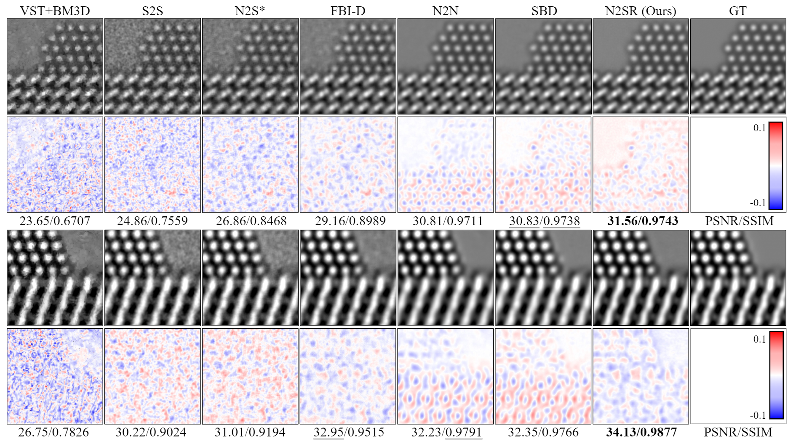

# ZS-Denoiser-HREM

This repository is Pytorch implementation of our manuscript "Zero-shot Image Denoising for High-Resolution Electron Microscopy"

## Pipeline of ZS-Denoiser 


  
  Fig. 1: The pipeline of ZS-Denoiser HREM 

---

## Simulated HREM Denoising Example
 
 Fig. 2: Comparison of denoising results of simulated Pt/CeO2 catalyst corrputed with Poisson-Gaussain noise.

## Real HREM Denoising Example
 
 Fig. 3 Comparison of denoising results of real STEM data on zeolites.
 
---

### 1. Running Environment
To run this project, you will need the following packages:
  
  - Pytorch
  - Scikit-image
  - Tiffile, tqdm, numpy and other packages.

### 2. Train the ZS-Denoiser on simulated HREM image

To train the denoising model for simulated HREM image corrupted with Poission-Gaussain noise ($a = 0.05, b = 0.02$), you can run the following command in your terminal:

```shell
python train.py -image_path demo_data/PtCeO2_simulated/1.tif -a 0.05 -b 0.02
```

### 3. License

This code is available for non-commercial research and education purposes only. It is not allowed to be reproduced, exchanged, sold, or used for profit.

### 4. Citation