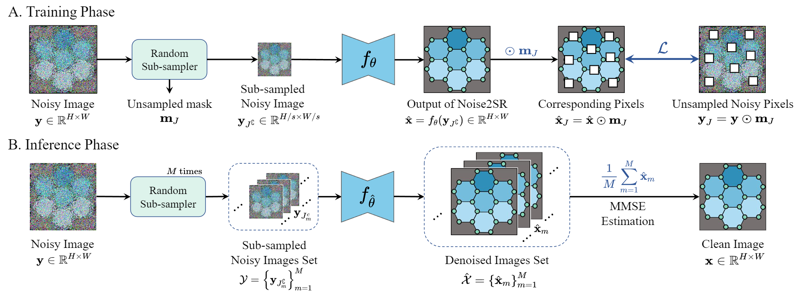

# ZS-Denoiser-HREM

This repository is Pytorch implementation of our manuscript "Zero-shot Image Denoising for High-Resolution Electron Microscopy"

 
 Fig. 1: The pipeline of ZS-Denoiser HREM

 
 Fig. 2: Comparison of denoising results of real STEM zeolites

